<h1 align="center">Bensa — On-Demand Home Services Platform</h1>

  A marketplace that connects customers in Libya with nearby technicians — plumbers, electricians, AC and satellite installers, carpenters — in real time.
   
  <b>Graduation project · Designed, built and deployed solo</b>

> **Source code is private.** This repository is a project overview. Code walkthroughs are available to recruiters and hiring teams on request.

---

## The problem

Finding a reliable technician in Libya usually means phone calls, word of mouth and no visibility on when someone will arrive. Most jobs are also paid in cash, which makes it hard for a platform to track what it is owed.

## The solution

A customer opens the app, picks a service, drops a pin on their location and sends a request. Nearby technicians who are online and qualified for that service are notified. The first to accept gets the job, and both sides follow it live — from *on the way* to *arrived*, *started* and *completed* — until it is paid and rated.

## Screenshots

### Customer app

  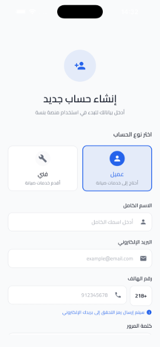
  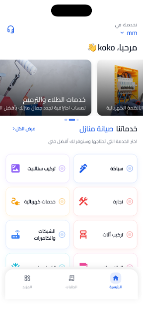
  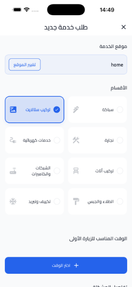
  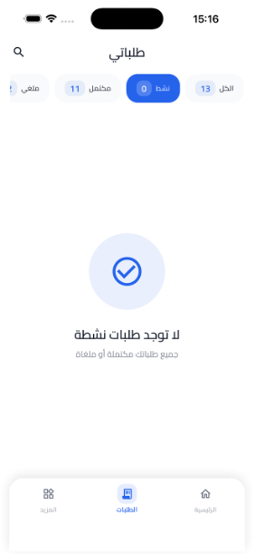

Sign up · Home & service categories · New request · My requests

### Technician app

  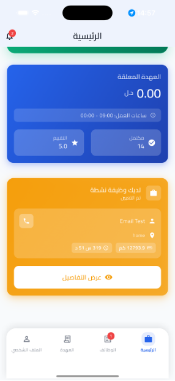
  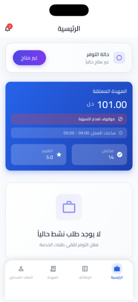
  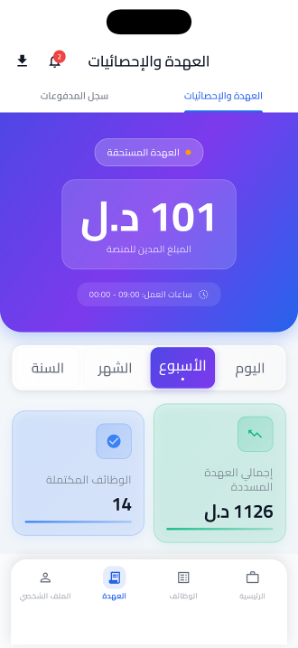

Active job · Paused for unsettled custody · Custody & statistics

### Admin panel

  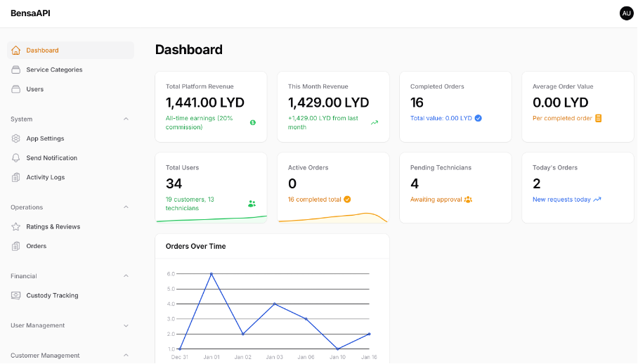

  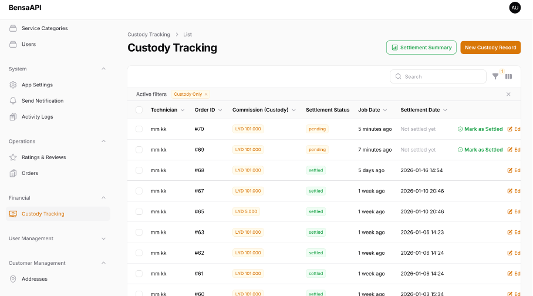
  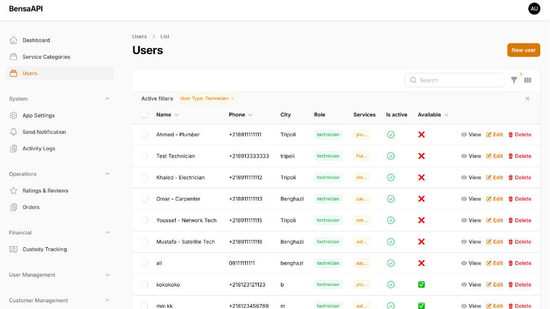

Dashboard · Custody tracking & settlement · User management

## Features

**Customers**
- Email sign-up with one-time-code (OTP) verification
- Create a request with service category, description, GPS location, priority and payment method
- Follow the job live through each status and rate the technician afterwards
- Saved addresses, notifications and a full Arabic (RTL) interface

**Technicians**
- Go online / offline with one tap; location is shared only while available
- See open requests nearby, sorted by distance and filtered by their skills
- Accept jobs, update progress step by step, and track earnings and stats

**Admins**
- Web admin panel to manage users, service categories, requests, earnings and settings

## Architecture

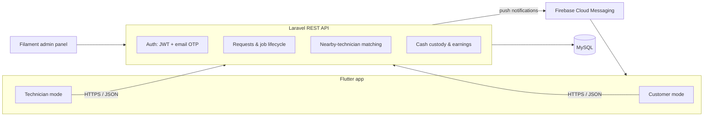

The backend follows a thin-controller design: controllers validate input and delegate, and all business rules live in a dedicated service layer. Roles are enforced with middleware, and every endpoint checks ownership — a customer only sees their own requests, a technician only their assigned jobs.

## Job lifecycle

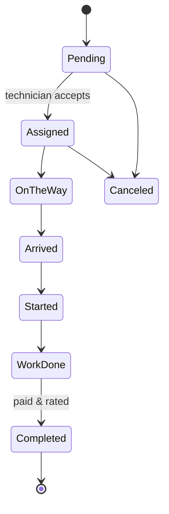

Every transition is validated on the server, so a job can never skip a step or be moved by the wrong user.

## Engineering highlights

**Matching requests to nearby technicians.** Technicians share their location while online. When a request is created, the backend finds technicians who are online, qualified for that category, within range and not already on a job — efficiently, on every update. Accepting a job is atomic, so two technicians can never take the same request.

**Cash custody.** Most jobs in Libya are paid in cash to the technician, but part of that money belongs to the platform. I designed a custody system that records what each technician owes, calculates earnings and withdrawals against it, and automatically pauses technicians whose unsettled balance passes a limit until they settle.

**Secure authentication.** Accounts must be verified by email before login. One-time codes expire quickly, are stored hashed, and can only be used once.

**Battery-aware live location.** Instead of sending GPS updates on a fixed timer, the app sends updates only when the technician has actually moved, pauses them when offline, and smooths out bursts of readings — keeping matching accurate without draining the battery.

## Tech stack

| Layer | Technologies |
|---|---|
| Mobile | Flutter, Dart, Dio, Google Maps, Geolocator, secure token storage |
| Backend | Laravel 10, PHP, REST API, JWT authentication |
| Database | MySQL |
| Admin panel | Filament |
| Notifications | Firebase Cloud Messaging |
| DevOps | Docker, Railway, Postman (API documentation & testing) |

## What I'd improve next

- Replace location polling with WebSockets for instant updates
- Add an online payment gateway alongside cash
- Expand automated test coverage of the job lifecycle and custody rules
- Move request distribution to a background queue for faster responses

## About me

**Mohammed Bseikri** — Software Engineer (Frontend & Mobile)
BSc in Software Engineering, Libyan International University (2026)

- LinkedIn: [linkedin.com/in/mohammed-bseikri](https://www.linkedin.com/in/mohammed-bseikri/)
- Portfolio: [mohammed-portfolio-cv.vercel.app](https://mohammed-portfolio-cv.vercel.app)
- Email: mohammedbseikri@gmail.com

---

© 2025–2026 Mohammed Bseikri. All rights reserved. Screenshots show test data from development.
